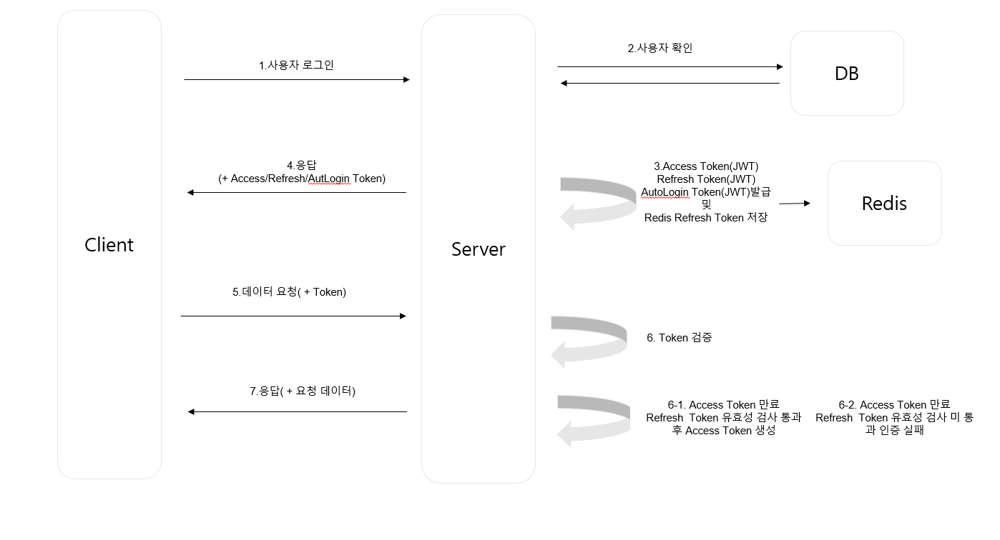

## 🔐 로그인 및 인증 흐름

### ✅ 인증 절차

1. **사용자가 로그인**을 시도합니다.
2. **DB를 통해 사용자 정보를 확인**합니다.
3. 사용자 인증이 완료되면, 서버는 아래 토큰들을 **발급**합니다:
    - `Access Token`
    - `Refresh Token` (→ Redis에 저장)
    - `AutoLogin Token` (선택 사항)

4. 생성된 토큰은 **헤더 또는 쿠키를 통해 클라이언트에 전달**됩니다.
5. 클라이언트는 보호된 API 요청 시 **Access Token을 포함하여 요청**합니다.
6. 서버는 해당 요청에서 **Access Token의 유효성을 검증**합니다.

   #### 만약 Access Token이 만료된 경우:
    - **6-1.** Redis에 저장된 Refresh Token을 통해 **유효성 검증**을 수행합니다.
        - 유효한 경우 → **Access Token을 재발급**하고 요청을 처리합니다.
    - **6-2.** Refresh Token도 만료되었거나 유효하지 않다면 →  
      서버는 `CustomApiException`을 발생시켜 **인증 실패 응답**을 반환합니다.

7. 인증이 성공적으로 완료되면, 서버는 **요청한 데이터를 응답**으로 전달합니다.