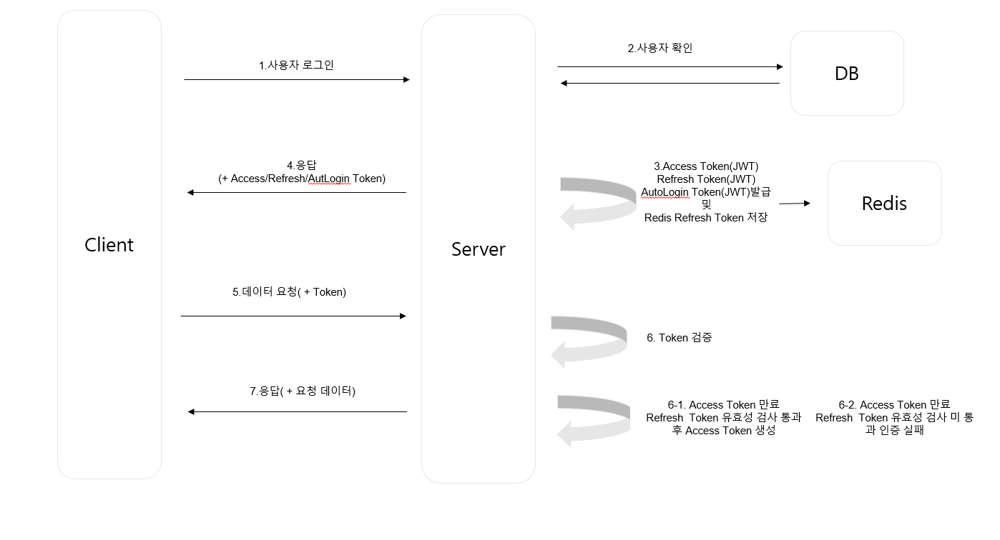

## 🔐 로그인 및 인증 흐름

[🔝 메인 목차로 이동](../../README.md)
 

## 🧭 이 페이지에서 다루는 내용

  - [✅ 인증 절차](#-인증-절차)
  - [🗃️ 토큰 저장 방식 요약](#️-토큰-저장-방식-요약)
  - [💿 AccessToken 재발급 방식](#-accesstoken-재발급-방식)
  - [💿 Access Token 발급 흐름](#-access-token-발급-흐름)

### ✅ 인증 절차

1. **사용자가 로그인**을 시도합니다.
2. **DB를 통해 사용자 정보를 확인**합니다.
3. 사용자 인증이 완료되면, 서버는 아래 토큰들을 **발급**합니다.

   - `Access Token`
   - `Refresh Token` (→ Redis에 저장)
   - `AutoLogin Token` (자동 로그인 설정 시 생성되며, 클라이언트의 `HttpOnly` 쿠키에 저장됩니다.  
     주로 브라우저를 닫았다 열어도 로그인이 유지되도록 합니다.)

4. 생성된 토큰은 **헤더 또는 쿠키를 통해 클라이언트에 전달**됩니다.
5. 클라이언트는 보호된 API 요청 시 **Access Token을 포함하여 요청**합니다.
6. 서버는 해당 요청에서 **Access Token의 유효성을 검증**합니다.

   #### Access Token이 만료된 경우:

   - **6-1.** Redis에 저장된 Refresh Token을 통해 **유효성 검증**을 수행합니다.
     - 유효한 경우 → **Access Token을 재발급**하고 요청을 처리합니다.
   - **6-2.** Refresh Token도 만료되었거나 유효하지 않다면 →  
     서버는 `CustomApiException`을 발생시켜 **인증 실패 응답**을 반환합니다.

7. 인증이 성공적으로 완료되면, 서버는 **요청한 데이터를 응답**으로 전달합니다.

---

### 🗃️ 토큰 저장 방식 요약

| 토큰 유형       | 저장 위치                 | 만료 시간                                                        |
| --------------- | ------------------------- | ---------------------------------------------------------------- |
| Access Token    | 클라이언트 (헤더 or 쿠키) | 짧음 (예: 30분)                                                  |
| Refresh Token   | Redis                     | 김 자동 로그인 시 (예: 7일)  자동 미 로그인 시 (예: 1일) |
| AutoLogin Token | 클라이언트 쿠키           | 선택적 (예: 7일)                                                 |

---

### 💿 AccessToken 재발급 방식

- JwtAuthorizationFilter에 handleAccessTokenValidation 함수에서
  accessToken 검증 후 토큰 만료 Exception 시 cookie의 Refresh Token 값과
  redis에 저장 된 Refresh Token 을 비교 후 일치한다면
  헤더로 Access Token을 자동으로 갱신하여 클라이언트로 보냅니다.

---

### 💿 Access Token 발급 흐름

   

  

    
<strong>✔️ 발급 성공</strong>

    
  

  

    
<strong>❌ 발급 실패</strong>

    
  

