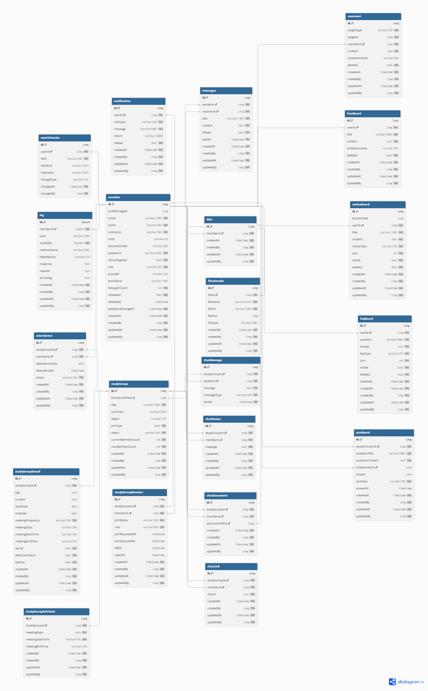

## 🔌 DB 다이어 그램

[🔝 메인 목차로 이동](../../README.md)

### ✅ ERD [dbdiagram.io]



<br><br>
### Table 
<details> 
<summary>클릭하여 펼치기</summary>

```h2
// 사용자 테이블
Table member {
  id Long [pk, increment, note: '사용자 고유 ID']
  profileImageId Long [note: '프로필 사진 파일 ID']
  email varchar(100) [unique, not null, note: '이메일 주소']
  name varchar(50) [not null, note: '사용자 이름']
  nickname varchar(30) [not null, note: '사용자 닉네임']
  birth varchar(8) [note: '생년월일 (YYYYMMDD)']
  phoneNumber varchar(20) [note: '휴대폰 번호']
  password varchar(255) [not null, note: '비밀번호 해시값 (bcrypt)']
  isEmailAgreed bool [default: false, not null, note: '이메일 수신 동의 여부']
  role varchar(20) [default: 'user', not null, note: 'user / admin ']
  provider varchar(10) [note: '소셜 로그인 타입 (Google, kakao , Naver)']
  providerId varchar(100) [note: '소셜 로그인 Id']
  failLoginCount int [default:0 , not null , note:'비밀번호 실패 횟수']
  isDeleted bool [default: false, not null, note: '탈퇴 여부 (false=정상, true=탈퇴)']
  deletedAt timestamp [note: '탈퇴 처리 일시']
  passwordChangeAt timestamp [default: `now()`, not null, note: '비밀번호 변경 일시']

  createdAt timestamp [default: `now()`, not null, note: '등록일시']
  createdBy Long [not null, note: '등록자 ID']
  updatedAt timestamp [default: `now()`, not null, note: '수정일시']
  updatedBy Long [not null,note: '수정자 ID']

  Indexes {
    (id) [pk]
    (email, provider) [unique] // 이메일 + 소셜타입 조합으로 unique
    }
  }

// 사용자 변경 이력 테이블
Table userHistories {
  id Long [pk, increment, note: '히스토리 고유 ID']
  userId Long [not null, ref: > member.id, note: '변경 대상 사용자 ID']
  field varchar(50) [not null, note: '변경된 필드명 (ex: nickname, email 등)']
  oldValue varchar(255) [note: '변경 전 값']
  newValue varchar(255) [note: '변경 후 값']
  changeType varchar(10) [default: 'update', note: '변경 유형 (create, update, delete)']

  changedAt timestamp [default: `now()`, not null, note: '변경 시각']
  changedBy Long [not null, note: '수정한 사용자 ID (본인 또는 관리자)']

  Indexes {
    (id) [pk]
    (userId)
    (changedBy)
  (userId, field)
    }
  }

// 파일 그룹(묶음) 테이블
Table files {
  id Long [pk, increment, note: '파일 그룹 고유 ID']
  memberId Long [not null, ref: > member.id, note: '사용자 ID']

  createdAt timestamp [default: `now()`, not null, note: '등록일시']
  createdBy Long [not null, note: '등록자 ID']
  updatedAt timestamp [default: `now()`, not null, note: '수정일시']
updatedBy Long [not null,note: '수정자 ID']

  Indexes {
    (id) [pk]
    (memberId)
    }
  }

// 개별 파일 테이블
Table filesDetails {
  id Long [pk, increment, note: '파일 상세 고유 ID']
  fileId Long [not null, ref: > files.id, note: '속한 파일 그룹 ID (files.id 참조)']
  fileName varchar(255) [not null, note: '원본 파일명']
  fileUrl varchar(500) [not null, note: '저장된 파일 URL']
  fileSize Long [note: '파일 크기 (byte)']
  fileType varchar(100) [note: '파일 MIME 타입 (ex: image/png)']

  createdAt timestamp [default: `now()`, not null, note: '등록일시']
  createdBy Long [not null, note: '등록자 ID']
  updatedAt timestamp [default: `now()`, not null, note: '수정일시']
  updatedBy Long [not null,note: '수정자 ID']

  Indexes {
    (id) [pk]
    (fileId)
    (createdBy)
    }
  }

//자유 게시판 테이블
Table freeBoard {
  id Long [pk , increment,note:'자유 게시판 고유 ID']
  userId Long [not null, ref: > member.id, note: '등록 사용자 ID']
  title varchar(200) [not null , note:'자유 게시판 제목']
  content text [not null, note: '에디터 입력 내용']
  writeNickname varchar(30) [note: '작성자 닉네임']
  deleted  bool [default: false, not null, note: '삭제 여부(false=미삭제, true=삭제)']

  createdAt timestamp [default: `now()`, not null, note: '등록일시']
  createdBy Long [not null, note: '등록자 ID']
  updatedAt timestamp [default: `now()`, not null, note: '수정일시']
  updatedBy Long [not null,note: '수정자 ID']

  Indexes {
    (id) [pk]
    (title)
    (writeNickname)
    (deleted)
    }
  }

//공지사항 게시판 테이블
Table noticeBoard {
  id Long [pk , increment,note:'공지사항 게시판 고유 ID']
  thumbFileId Long [note: '썸네일 파일 ID (files.id 참조)']
  userId Long [not null, ref: > member.id, note: '등록 사용자 ID']
  title varchar(100) [not null , note:'자유 게시판 제목']
  content text [not null, note: '에디터 입력 내용']
  noticeType varchar(10) [not null , note:'공지사항 타입']
  sort int [not null , note:'정렬 순번']
  visible bool [default: true, not null, note: '노출 여부']
  deleted  bool [default: false, not null, note: '삭제 여부(false=미삭제, true=삭제)']

  createdAt timestamp [default: `now()`, not null, note: '등록일시']
  createdBy Long [not null, note: '등록자 ID']
  updatedAt timestamp [default: `now()`, not null, note: '수정일시']
  updatedBy Long [not null,note: '수정자 ID']

  Indexes {
    (id) [pk]
    (title)
    (visible)
    (deleted)
    }
  }

//FAQ 게시판 테이블
Table faqBoard {
  id Long [pk , increment,note:'FAQ 게시판 고유 ID']
  userId Long [not null, ref: > member.id, note: '등록 사용자 ID']
  question varchar(500) [not null , note:'FAQ 질문']
  answer  text [not null, note: 'FAQ 답변']
  faqType varchar(10) [not null , note:'FAQ 타입']
  sort int [not null , note:'정렬 순번']
  visible bool [default: true, not null, note: '노출 여부(false=미노출, true=노출)']
  deleted  bool [default: false, not null, note: '삭제 여부(false=미삭제, true=삭제)']
  readDate timestamp [not null, note: '읽은 시간']

  createdAt timestamp [default: `now()`, not null, note: '등록일시']
  createdBy Long [not null, note: '등록자 ID']
  updatedAt timestamp [default: `now()`, not null, note: '수정일시']
  updatedBy Long [not null,note: '수정자 ID']

  Indexes {
    (id) [pk]
    (question)
    (deleted)
    }
  }

//QNA 게시판 테이블
Table qnaBoard {
  id Long [pk , increment, note:'QNA 게시판 고유 ID']
  questionUserId Long [not null, ref: > member.id, note: '질문 사용자 ID']
  questionTitle varchar(500) [not null, note:'QNA 질문 제목']
  questionContent text [not null , note: 'QNA 질문내용']
  answerUserId Long [ref: > member.id, note: '답변 사용자 ID (nullable)']
  answer text [note: 'QNA 답변 (nullable)']
  qnaType varchar(20) [not null, note:'QNA 타입']
  answerAt timestamp [note: '답변등록일시']

  createdAt timestamp [default: `now()`, not null, note: '등록일시']
  createdBy Long [not null, note: '등록자 ID']
  updatedAt timestamp [default: `now()`, not null, note: '수정일시']
  updatedBy Long [not null,note: '수정자 ID']

  Indexes {
    (id) [pk]
    (questionTitle)
    (qnaType)
    }
  }

// 알림 테이블
Table notification {
  id Long [pk, increment, note: '알림 고유 ID']
  userId Long [not null, ref: > member.id, note: '알림 받을 사용자 ID']
  notiType varchar(30) [not null, note: '알림 타입 (comment, answer, notice, system 등)']
  message varchar(500) [not null, note: '알림 메시지']
  linkUrl varchar(2000) [note: '링크 URL']
  isRead bool [default: false, not null, note: '읽음 여부 (false=안읽음, true=읽음)']

  createdAt timestamp [default: `now()`, not null, note: '등록일시']
  createdBy Long [not null, note: '등록자 ID']
  updatedAt timestamp [default: `now()`, not null, note: '수정일시']
  updatedBy Long [not null,note: '수정자 ID']

  Indexes {
    (id) [pk]
    (userId)
    (isRead)
    }
  }

//스터디 그룹 마스터 테이블
Table studyGroup {
  id Long [pk, increment, note: '스터디 그룹 고유 ID']
  thumbnailFileId Long [ref: > files.id, note: '썸네일 파일 ID']
  title varchar(100) [not null, note: '스터디 그룹 이름']
  summary varchar(255) [note: '스터디 그룹 요약 설명']
  region varchar(10) [note: '지역 (ex: 서울, 부산, 온라인)']
  joinType bool [default: true, not null, note: '가입 방식 여부 (false=자유가입, true=승인가입)']
  status varchar(20) [default: 'active', not null, note: '그룹 상태 (active, closed)']
  currentMemberCount int [default: 0, not null, note: '현재 인원']
  maxMemberCount int [not null, note: '최대 인원']

  createdAt timestamp [default: `now()`, not null, note: '등록일시']
  createdBy Long [not null, note: '등록자 ID']
  updatedAt timestamp [default: `now()`, not null, note: '수정일시']
  updatedBy Long [not null,note: '수정자 ID']

  Indexes {
    (id) [pk]
    (region)
    (joinType)
    (status)
    }
  }

//스터디 그룹 상세 테이블
Table studyGroupDetail {
  id Long [pk, increment, note: '스터디 상세 고유 ID']
  studyGroupId Long [not null, ref: > studyGroup.id, note: '스터디 그룹 ID']
  tag text [note: '스터디 관련 태그 (ex: #리액트, #알고리즘)']
  content text [note: '스터디 상세 설명 (에디터 내용)']
  startDate date [note: '스터디 시작일']
  endDate date [note: '스터디 종료일']
  meetingFrequency varchar(20) [not null, note: '활동 빈도 (ex: 매주, 격주)']
  meetingDays varchar(50) [note: '모임 요일 (ex: 월,수,금)']
  meetingStartTime varchar(10) [note: '모임 시작 시간 (ex: 19:30)']
  meetingEndTime varchar(10) [note: '모임 종료 시간 (ex: 19:30)']
  secret bool [default: false, not null, note: '비밀방 여부 (false=미사용, true=사용)']
  allowComment bool [default: true, not null, note: '댓글 허용 여부 (false=미사용, true=사용)']
  latePay bool [default: true, not null, note: '지각비 여부 (false=미사용, true=사용)']

  createdAt timestamp [default: `now()`, not null, note: '등록일시']
  createdBy Long [not null, note: '등록자 ID']
  updatedAt timestamp [default: `now()`, not null, note: '수정일시']
  updatedBy Long [not null,note: '수정자 ID']

  Indexes {
    (id) [pk]
    (studyGroupId)
    }
  }

// 스터디 그룹 참여자 관리 테이블
Table studyGroupMember {
  id Long [pk, increment, note: '스터디 그룹 참여 고유 ID']
  studyGroupId Long [not null, ref: > studyGroup.id, note: '스터디 그룹 ID']
  memberId Long [not null, ref: > member.id, note: '참여자 사용자 ID']
  joinStatus varchar(20) [default: 'pending', not null, note: '참여 상태 (pending, approved, rejected, left)']
  role varchar(20) [default: 'member', not null, note: '역할 (member, leader)']
  joinRequestedAt timestamp [default: `now()`, note: '참여 요청 일시']
  joinApprovedAt timestamp [note: '승인 일시 (승인된 경우에만)']
  leftAt timestamp [note: '탈퇴 일시 (탈퇴한 경우에만)']
  rejectAt timestamp [note: '거절 일시 (탈퇴한 경우에만)']

  createdAt timestamp [default: `now()`, not null, note: '등록일시']
  createdBy Long [not null, note: '등록자 ID']
  updatedAt timestamp [default: `now()`, not null, note: '수정일시']
  updatedBy Long [not null,note: '수정자 ID']

  Indexes {
    (id) [pk]
    (studyGroupId)
    (memberId)
    (joinStatus)
    }
  }

// 스터디 출석 테이블
Table attendance {
  id Long [pk, increment, note: '스터디 출석 고유 ID']
  studyGroupId Long [not null, ref: > studyGroup.id, note: '스터디 그룹 ID']
  memberId Long [not null, ref: > member.id, note: '참여자 사용자 ID']
  attendanceDate date [note: '출석 날짜 (YYYY-MM-DD)']
  attendanceAt timestamp [default: `now()`, note: '출석 체크 일시']
  status varchar(20) [default: 'present', not null, note: '출석 상태 (present, absent, late)']

  createdAt timestamp [default: `now()`, not null, note: '등록일시']
  createdBy Long [not null, note: '등록자 ID']
  updatedAt timestamp [default: `now()`, not null, note: '수정일시']
  updatedBy Long [not null,note: '수정자 ID']

  Indexes {
    (id) [pk]
    (studyGroupId)
    (memberId)
    (attendanceDate)
    }
  }

// 스터디 그룹 스케줄 테이블
Table studyGroupSchedule {
  id Long [pk, increment, note: '스터디 스케줄 고유 ID']
  studyGroupId Long [not null, ref: > studyGroup.id, note: '스터디 그룹 ID']
  meetingDate date [not null, note: '모임 날짜 (YYYY-MM-DD)']
  meetingStartTime varchar(10) [not null, note: '모임 시작 시간 (HH:mm)']
  meetingEndTime varchar(10) [note: '모임 종료 시간 (HH:mm)']

  createdAt timestamp [default: `now()`, not null, note: '등록일시']
  createdBy Long [not null, note: '등록자 ID']
  updatedAt timestamp [default: `now()`, not null, note: '수정일시']
  updatedBy Long [not null,note: '수정자 ID']

  Indexes {
    (id) [pk]
    (studyGroupId)
    (meetingDate)
    }
  }

// 스터디 그룹 채팅 메시지 테이블
Table chatMessage {
  id Long [pk, increment, note: '스터디 그룹 채팅 메시지 고유 ID']
  studyGroupId Long [not null, ref: > studyGroup.id, note: '스터디 그룹 ID']
  senderId Long [not null, ref: > member.id, note: '보낸 사용자 ID']
  message text [not null, note: '채팅 메시지 내용']
  messageType varchar(20) [default: 'text', not null, note: '메시지 타입 (text, image 등)']
  sentAt timestamp [default: `now()`, not null, note: '보낸 시각']

  Indexes {
    (id) [pk]
    (studyGroupId)
    (senderId)
    (sentAt)
    }
  }

// 스터디 그룹 공지 테이블
Table chatNotice {
  id Long [pk, increment, note: '스터디 그룹 공지 고유 ID']
  studyGroupId Long [not null, ref: > studyGroup.id, note: '스터디 그룹 ID']
  memberId Long [not null, ref: > member.id, note: '공지 작성 사용자 ID']
  message text [not null, note: '공지 내용']

  createdAt timestamp [default: `now()`, not null, note: '등록일시']
  createdBy Long [not null, note: '등록자 ID']
  updatedAt timestamp [default: `now()`, not null, note: '수정일시']
  updatedBy Long [not null,note: '수정자 ID']

  Indexes {
    (id) [pk]
    (studyGroupId)
    }
  }

// 스터디 그룹 자료 테이블
Table chatDocument {
  id Long [pk, increment, note: '스터디 그룹 자료 고유 ID']
  studyGroupId Long [not null, ref: > studyGroup.id, note: '스터디 그룹 ID']
  memberId Long [not null, ref: > member.id, note: '자료 작성 사용자 ID']
  documentFileId Long [ref: > files.id, note: '자료 파일 ID']

  createdAt timestamp [default: `now()`, not null, note: '등록일시']
  createdBy Long [not null, note: '등록자 ID']
  updatedAt timestamp [default: `now()`, not null, note: '수정일시']
  updatedBy Long [not null,note: '수정자 ID']

  Indexes {
    (id) [pk]
    (studyGroupId)
    }
  }


// 스터디 그룹 링크 테이블
Table chatLink {
  id Long [pk, increment, note: '스터디 그룹 링크 고유 ID']
  studyGroupId Long [not null, ref: > studyGroup.id, note: '스터디 그룹 ID']
  memberId Long [not null, ref: > member.id, note: '링크 작성 사용자 ID']
  linkUrl text [not null , note: '링크 URL']

  createdAt timestamp [default: `now()`, not null, note: '등록일시']
  createdBy Long [not null, note: '등록자 ID']
  updatedAt timestamp [default: `now()`, not null, note: '수정일시']
  updatedBy Long [not null,note: '수정자 ID']

  Indexes {
    (id) [pk]
    (studyGroupId)
    }
  }

// 쪽지 테이블
Table messages { 
  id Long [pk, increment, note: '쪽지 고유 ID']
  senderId Long [not null, ref: > member.id, note: '보낸 사용자 ID']
  receiverId Long [not null, ref: > member.id, note: '받은 사용자 ID']
  title varchar(100) [not null, note: '쪽지 제목']
  content text [not null, note: '쪽지 내용']
  isRead bool [default: false, not null, note: '읽음 여부 (false=안 읽음, true=읽음)']
  sentAt timestamp [default: `now()`, not null, note: '쪽지 보낸 시각']

  createdAt timestamp [default: `now()`, not null, note: '등록일시']
  createdBy Long [not null, note: '등록자 ID']
  updatedAt timestamp [default: `now()`, not null, note: '수정일시']
  updatedBy Long [not null,note: '수정자 ID']

  Indexes {
    (id) [pk]
    (senderId)
    (receiverId)
    (isRead)
    }
  }

// 통합 댓글 테이블
Table comment {
  id Long [pk, increment, note: '댓글 고유 ID']
  targetType varchar(30) [not null, note: '댓글이 달린 게시판 종류 (freeBoard, notice, etc.)']
  targetId Long [not null, note: '댓글이 달린 게시글 ID']
  memberId Long [not null, ref: > member.id, note: '작성자 ID']
  content text [not null, note: '댓글 내용']
  writeNickname varchar(30) [note: '작성자 닉네임']
  deleted  bool [default: false, not null, note: '삭제 여부(false=미삭제, true=삭제)']

  createdAt timestamp [default: `now()`, not null, note: '등록일시']
  createdBy Long [not null, note: '등록자 ID']
  updatedAt timestamp [default: `now()`, not null, note: '수정일시']
  updatedBy Long [not null,note: '수정자 ID']

  Indexes {
    (id) [pk]
    (targetType, targetId)
    (memberId)
    (writeNickname)
    (deleted)
    }
  }

Table log {
  id bigint [pk, increment, note: "로그 고유 ID"]
  memberId bigint [not null, ref: > member.id, note: "요청한 사용자 ID (FK)"]
  uuid varchar(255) [note: "트레이싱용 UUID"]
  sucesStts boolean [not null, note: "성공 여부"]
  methodName varchar(255) [note: "AOP 메서드명"]
  httpMethod varchar(10) [note: "HTTP 메서드 (GET, POST 등)"]
  response text [note: "응답 본문 (최대 4000자)"]
  request text [note: "요청 본문 (최대 4000자)"]
  errorMsg text [note: "에러 메시지 (최대 4000자)"]

  createdAt timestamp [default: `now()`, not null, note: '등록일시']
  createdBy Long [not null, note: '등록자 ID']
  updatedAt timestamp [default: `now()`, not null, note: '수정일시']
  updatedBy Long [not null,note: '수정자 ID']

  Indexes {
    (memberId)
    }
  }

```
</details>